# PixelHabit

  

PixelHabit - A beautiful, minimalist habit tracker for Android, built with Material 3 design style

## Main Screen
View **key information**, **statistics**, **streaks**, and **habits for today**, with the option to **quickly** complete them.

  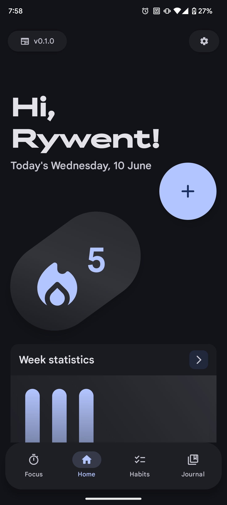
  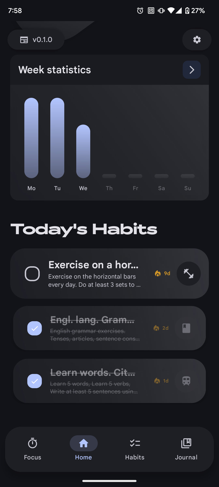

## Habits Screen
Manage **everything**. Create new **Habits**, **Lifestyles**, and **Quests**.
Customize your **habits** however you like with a **wide range of colors**, **icons**, **timing options**, and **time-of-day** settings as well as **grouping habits by lifestyle**, and more.

View **statistics** and **key information** for what you need.

  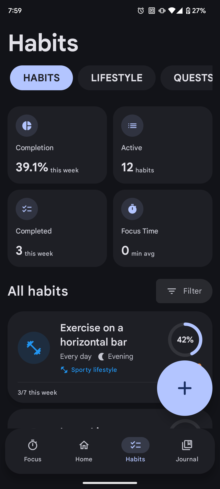
  

## Habit Information
View **all information** about your habit such as its **name**, **description**, and **heatmap** and **edit** it *if needed.*

  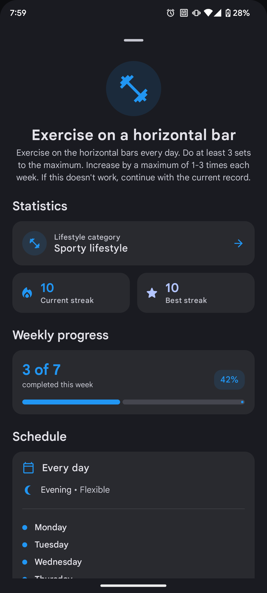
  

### Filter Your Habits
Convenient sorting of habits by day of the week, lifestyle, and completion status (completed/not completed).

  

## Lifestyle Screen
**Create** and **manage** your lifestyles to better build habits. View **statistics** for the habits associated with a specific lifestyle.

  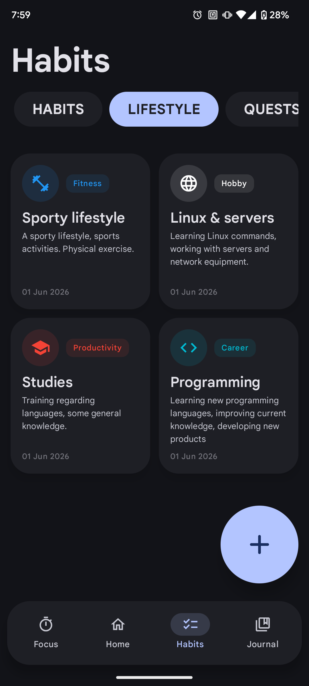

### View Lifestyle Information
View all lifestyle information and edit it if necessary.

  

## Focus Screen
Stay in the zone with a **Pomodoro-style timer**, **custom presets**, **ambient sounds**, and **habit linking**. Build deep work sessions that fit your rhythm.

Choose a mode (**Pomodoro**, **Deep Work**, **Flow**, or **Custom**), link a habit for the day, and track progress with a clean circular timer.

  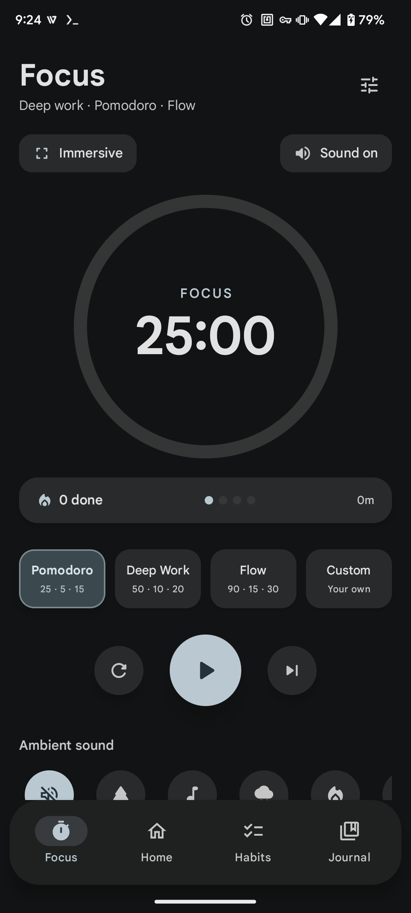
  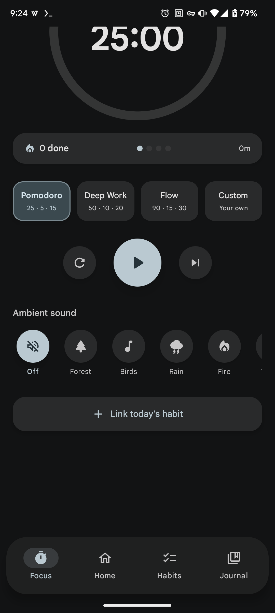
  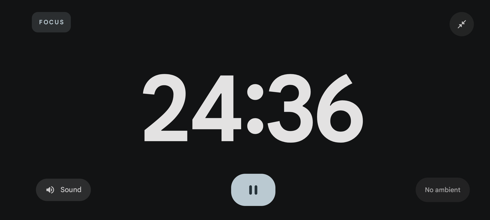

### Timer Presets
Pick a built-in preset or create your **own multi-stage sessions** with custom focus and break lengths.

  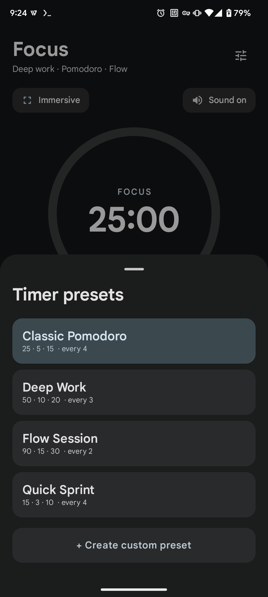
  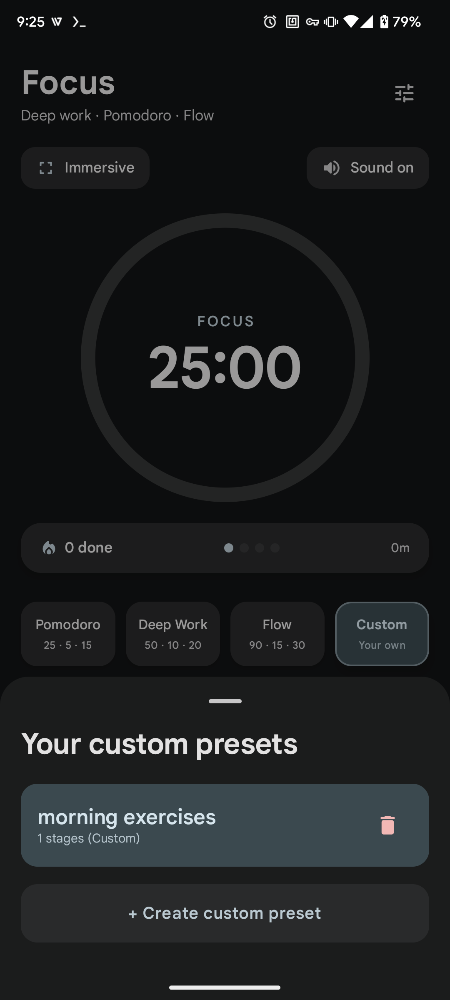
  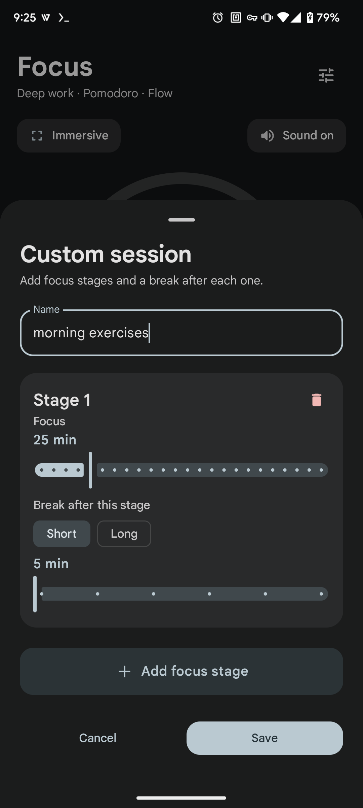

### Link Habits & Recover Sessions
**Link today’s habit** so focus minutes count toward your stats. If a session was interrupted, you can **resume from the exact time** it was left.

  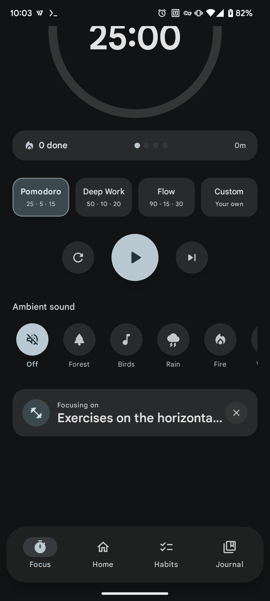
  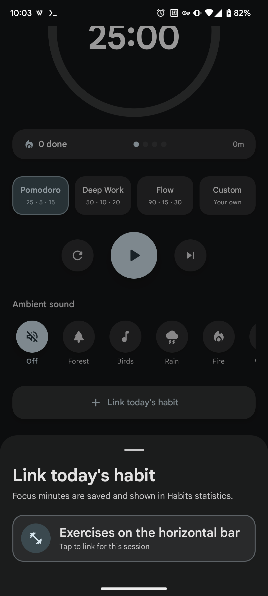
  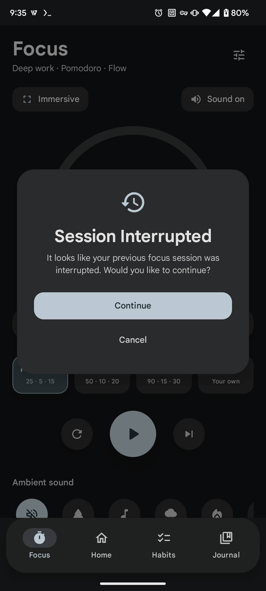

## ✨ Features

### 🎨 Modern UI/UX
- **Material You** - Dynamic colors that match your wallpaper
- **Fluid Animations** - Smooth transitions and subtle micro-interactions
- **Dual Theme** - Auto or manual dark/light mode switching