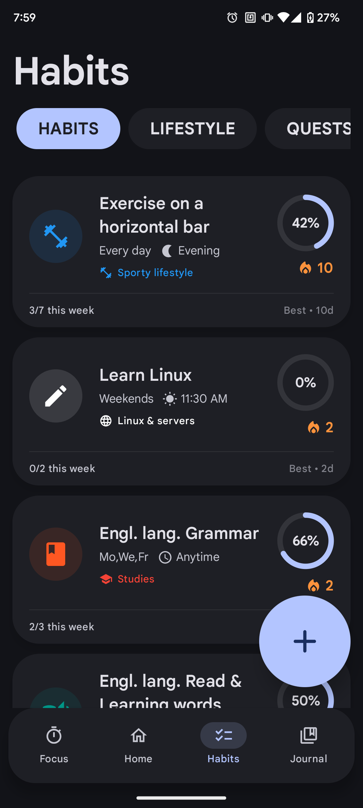
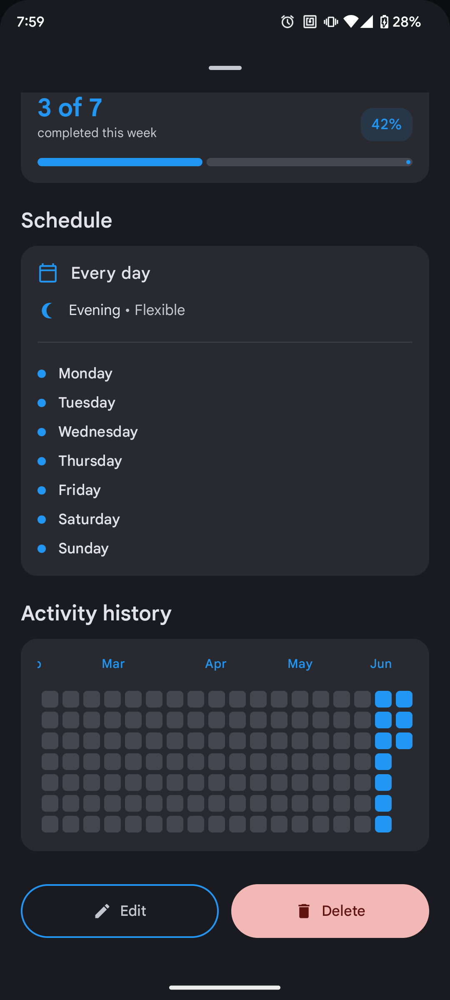
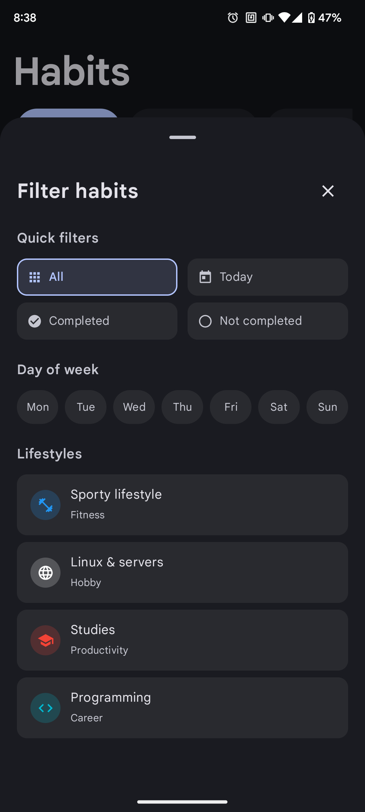
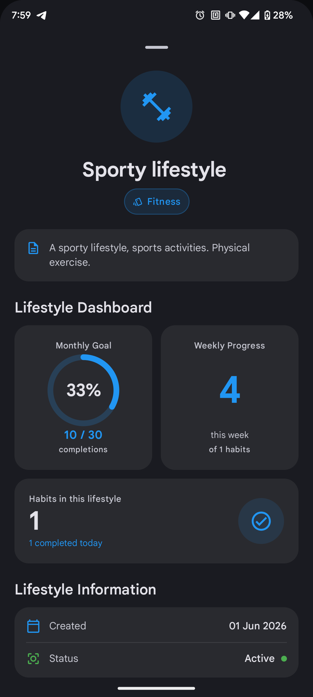

# PixelHabit

  

PixelHabit - A beautiful, minimalist habit tracker for Android, built with Material 3 design style

## Main Screen
View **key information**, **statistics**, **streaks**, and **habits for today**, with the option to **quickly** complete them.

  
  

## Habits Screen
Manage **everything**. Create new **Habits**, **Lifestyles**, and **Quests**. 
Customize your **habits** however you like with a **wide range of colors**, **icons**, **timing options**, and **time-of-day** settings as well as **grouping habits by lifestyle**, and more.

View **statistics** and **key information** for what you need.

  
  

## Habit Information
View **all information** about your habit such as its **name**, **description**, and **heatmap** and **edit** it *if needed.*

  
  

### Filter Your Habits
Convenient sorting of habits by day of the week, lifestyle, and completion status (completed/not completed).

  

## Lifestyle Screen
**Create** and **manage** your lifestyles to better build habits. View **statistics** for the habits associated with a specific lifestyle.

  

### View Lifestyle Information
View all lifestyle information and edit it if necessary.

  

